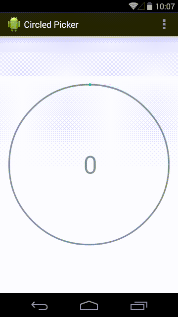

CircledPicker
=========

CircledPicker is an awesome, simple circular picker for Android. It can display value in four formats: hours, seconds, percentage and numeric, and it provides a basic set of parameters to customize.



Usage
----

In order to use CircledPicker in your project, import it as module and then declare into your XML layout:

```sh
<org.angmarch.circledpicker.CircledPicker
    android:id="@+id/circled_picker"
    android:layout_width="wrap_content"
    android:layout_height="wrap_content"
    app:pickerMode="percent"
    app:maxValue="100"
    app:step="5">
</org.angmarch.circledpicker.CircledPicker>
```

Don't forget to import the correct namespace in the root tag of your layout too:
```sh
xmlns:app="http://schemas.android.com/apk/res-auto"
```

Then you can customize CircledPicker more with:
* app:textColor
* app:textSize
* app:lineColor
* app:subLineColor
* app:outerThickness
* app:innerThickness

